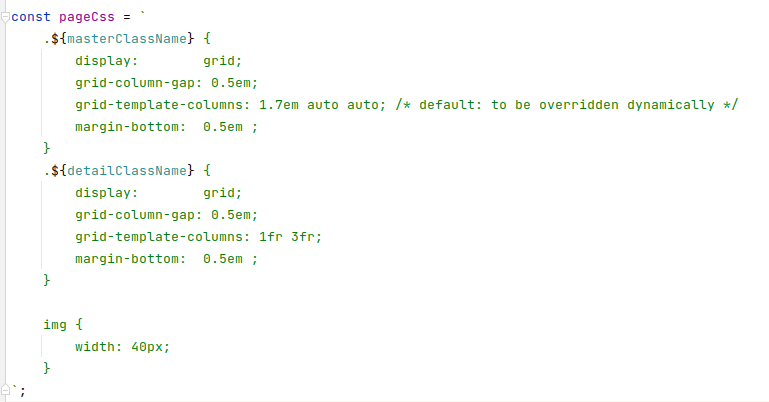

# Vakansie

This repository was extracted from the [original Vakanise project](https://github.com/mab9/vakansie). Keep sings small to explore more new stuff... 

<!--- These are examples. See https://shields.io for others or to customize this set of shields. You might want to include dependencies, project status and licence info here --->


<!---->

A vacation planer that serves as my personal tech toolkit 

Vakansie is a web app that contains many concepts and examples from a technical point of view. 
To that, concepts shall be applicable and testable in a fast way to earn knowledge. One of my favorite part. 
This project shall help me to grow and specialize my skills. 


## Installing vakansie

To install vakansie, follow these steps:

``` 
git clone https://github.com/mab9/calendario.git
./vakansie/js-client-iteration-2/index.html # open in your favorite browser
```

**Only the frontend part of the web app is available at the moment.** 


## Vakansie js-client

### 1 iteration - the projector pattern

[Projector Pattern](https://github.com/mab9/calendario/blob/main/js-client-iteration-1/index.html)

<details>
    <summary>Problems</summary>
    <li>
        Implementing dedicated views for many screens
        including model binding leads to much code that
        needs to be created, tested, and maintained.
    </li>
    <li>
        Moreover, this code is UI-toolkit specific and
        needs to be replaced with any change of the
        toolkit. The sheer amount of code can make this
        prohibitively expensive.
    </li>
</details>
<br>

<details>
    <summary>Solution</summary>
    <li>Rich Presentation Models / Attributes</li>
    <li>Abstract Factory (GOF): IProjector</li>
</details>
<br>

<details>
    <summary>Related patterns</summary>
    <li>Components - Dependency to data is reversed. Can be used as projection target.</li>
    <li>Abstract UI Toolkit - Applicable in a limited context, where least common denominator between all UI technologies is OK</li>
</details>
<br>


### 2 iteration - development strategy, TDD, local and remote

Apply test and CSS, local development

- describe test suite
- describe local starter and platform config
- remote starter

### 3 iteration - refactor projector, projector CSS, whatsoever - i18n - object override, whatsoever

Generalize projector, so that it may also be used with other models?

#### CSS reworks and improvements
CSS may be written in a dedicated .css file. There is the possibility <br> to write the CSS code directly within the projector itself, where the structure of the projector is defined...  

The advantage of writing and gluing the structural CSS code next to where it belongs is,<br> to code with loose coupling. The projector may be reused without opening and touching lots of files.   




In my example, I didn't define the structure next to the projector itself. For the moment it is OK to have it separated within the projector.css file.

#### i18n update translation without page refresh

There is a pitfall, observables must always be discharged. 

This approach will always render new elements and therefore as well new i18n translations. 


By considering the translation service, we recognize that every translation creates a listener.


We don't like this... Thats why we came up with the following idea.

No i18n rerendering, only values gets updated. This approach is more flexible, <br>
there is no need of taking care of discharging the language observable. <strong>But this will not always work.</strong>
When removing an element (delete a model object), we have again to deal with discharching i18n listeners...


Conclusion: i18n without page refresh is cool. There is one major downside, we have to deal with discharing of i18n listeners.

### x iteration - molds - selection molds

Make use of the selection mold pattern, to be able to synchronize models on the whole application.

Webcl week 14

### x iteration - prod preparations

- obfuscating? - yes or no...
- minifying
- bundling js code

### x iteration - core js code extraction

Remove all not necessary code. Build a KISS framework without all not needed
church code. 

## Contributing to Vakansie

<!--- If your README is long or you have some specific process or steps you want contributors to follow, consider creating a separate CONTRIBUTING.md file--->
To contribute to Vakansie, follow these steps:

1. Fork this repository.
2. Create a branch: `git checkout -b <branch_name>`.
3. Make your changes and commit them: `git commit -m '<commit_message>'`
4. Push to the original branch: `git push origin calendario/<location>`
5. Create the pull request.

Alternatively see the GitHub documentation on [creating a pull request](https://help.github.com/en/github/collaborating-with-issues-and-pull-requests/creating-a-pull-request).

## Contributors

Thanks to the following people who have contributed to this project:

* [@mab9](https://github.com/mab9) 📖

<!-- You might want to consider using something like the [All Contributors](https://github.com/all-contributors/all-contributors) specification and its [emoji key](https://allcontributors.org/docs/en/emoji-key). -->

## Contact

If you want to contact me you can reach me at **marcantoine.bruelhart@gmail.com.**

## License
<!--- If you're not sure which open license to use see https://choosealicense.com/--->

This project uses the following license: [GNU GPLv3](https://choosealicense.com/licenses/gpl-3.0/).